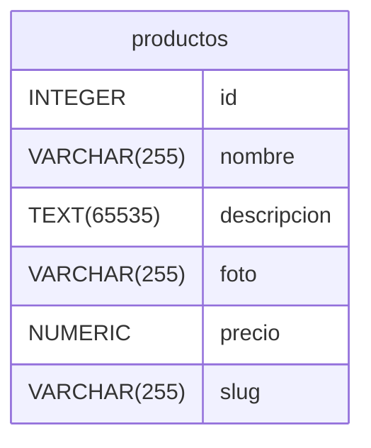

# ✂️ URLs Lipias con Apache + HTACCESS + Base de Datos

Vamos a crear una pequeña web / app para un catálogo de productos de una tienda o similar.
El objetivo de este ejercicio es lograr el uso de URLs amigables o limpias que eviten cosas del tipo:
mi-web.com/contacto.php
mi-web.com/ficha.php?id=5
mi-web.com/ficha.php?slug=nombre-del-producto

Y lo sustituyan por algo tipo:
mi-web.com/contacto
mi-web.com/productos/nombre-del-producto

También aprovecharemos para implementar un Error 404 personalizado.

## 📝 Proceso de Trabajo e Indice de contenidos

0. [🍼 Primeros pasos](#primeros-pasos)
1. [Construcción de la Estructura de la Web / App](#Estructura-de-mi-Web-App)
)
2. [Programación de Elementos básicos]
3. [Base de Datos: Creación y conexión con la web]
4. [Apache y .htaccess]
---

## 🍼 Primeros pasos
1. Crea un nuevo servidor en `Local` (para que no interfiera con otros desarrollos. Y como siempre borramos todo el contenidod e public)
2. Activa **Apache** en lugar de Nginx y dale a Aplicar (.htaccess sólo funciona en apache)

## 🏗️ Estructura de mi Web App

Orden de archivos y carpetas con las que vamos a trabajar:
| **Archivo**     | **Tipo de Archivo**  | **Directorio** | **Qué hará**                                                                                                |
|-----------------|----------------------|----------------|-------------------------------------------------------------------------------------------------------------|
| `index.php`     | PHP (apartado)       | `/`            | - Incluye `_header.php` y `_footer.php`.<br>- Listado de productos (conexión a la base de datos y bucle). |
| `_header.php`   | PHP (parcial)        | `/includes/`   | - Elementos de apertura del HTML.<br>- Navegación de la cabecera. |
| `_footer.php`   | PHP (parcial)        | `/includes/`   | - Elementos del footer.<br>- Cierre del HTML. |
| `_config.php`   | PHP (configuración)  | `/icnludes/`   | - Se carga en todos los apartados.<br>- Contiene constantes con datos habituales.<br>- Funciones reutilizables. |
| `ficha.php`     | PHP (apartado)       | `/`            | - Muestra información del producto individual. |
| `contacto.php`  | PHP (apartado)       | `/`            | - Muestra información de contacto de la empresa. |
| ``     |  PHP (apartado)      | `/`            | - Contenido de la página 404 con redirección a la web de inicio. |
| `style.css`     | CSS                  | `/assets/css/` | - Define los estilos de la web. |
| `.htaccess`     | Configuración Apache | `/`            | - Define el archivo que se mostrará en caso de error 404.<br>- Reglas de URL limpias (ejemplo: `index.php` → `/inicio`, `contacto.php` → `/contacto`).<br>- Convierte `ficha.php?slug=nombre-producto` en `/producto/nombre-producto`. |


     
La estructura de carpetas será la siguiente:


  
```
    /📂mi-web/
    │── 📄 index.php          # Página principal (incluye header, listado de productos y footer)
    │── 📄 contacto.php        # Página de contacto
    │── 📄 ficha.php           # Página de producto individual (muestra detalles según slug)
    │── 📄            # Página 404 con redirección
    │── 📄 style.css             # Estilo CSS de mi web
    │── 📄 .htaccess             # Reglas de URL amigables y manejo de errores
    │
    ├── /📂includes/          # Carpeta para elementos reutilizables
    │   ├── 📄  _config.php       # Fragmentos de código necesarios para todos los apartados
    │   ├── 📄  _header.php       # Encabezado y menú de navegación
    │   ├── 📄 _footer.php       # Pie de página y cierre de HTML
    │
    ├── /📂assets/            # Archivos estáticos
        ├── /📂css/             # Estilos CSS
        ├── /📂js/              # Scripts JavaScript
        ├── /📂img/             # Imágenes del sitio
```
    
---
# 🖥️ Programación:

## 🔌 BLOQUES 
Elementos reutilizables escructuras o bloques de código HTML.
Como el header, footer, aside, etc:
- **`_config.php`** contendrá todas las fucniones, cosntantes y elementos retuilizables. Se cargará desde todos los apartados
- **`_header.php`** contiene la apertura del HTML y la cabecera de la web y se carga en todos los apartados.
- **`_footer.php`** contiene el footer y el cierre del HTML y también se carga en todos los apartados.
- **`_asside.php`** (no existen este caso) pero podría ser la columna lateral de un apartado blog (por ejemplo).

#### `_config.php`
Constantes y funciones que se podrían necesitar y estarán disponibles en todos los apartados.
```php
<?
const URL='https://mi-web.local';       // URL principal del proyecto
const TITULOWEB='Mi web de Productos';  // Nombre del proyecto
const LANG='es';                        // Idioma del proyecto
?>

```


#### `_header.php`
Programación para el bloque de la cabecera reutilizado en todos los apartados
```html
<!DOCTYPE html>
<html lang="<?=LANG?>">
<head>
    <meta charset="UTF-8">
    <meta name="viewport" content="width=device-width, initial-scale=1.0">
    <title><?=TITULO?></title>
</head>
<body>

<header>
    <nav>
        <ul>
            <li> <a href="inicio">Inicio</a></li>
            <li> <a href="contacto">Contacto</a></li>
        </ul>
    </nav>
</header>

<main>
    <h1><?=TITULO?></h1>
```

#### `_footer.php`
Programación para el bloque pie reutilizado en todos los apartado:
```html
</main>
<footer>
    <p>&Copy; Copyright <?=date('Y')?> <?=TITULOWEB?></p>
</footer>
</body>
</html>
```


## 📑 APARTADOS
Serían cada una de las secciones de la página web

#### `index.php`
```php
<? const TITULO ='Inicio'?>
<?php require 'includes/_config.php' ?>
<?php include 'includes/_header.php' ?>

<!-- Aquí el contenido del apartado -->

<?php include 'includes/_footer.php' ?>
```

#### `contacto.php`
```php
<? const TITULO ='Contacto'?>
<?php require 'includes/_config.php' ?>

<?php include 'includes/_header.php' ?>

<!-- Aquí el contenido de contacto-->
<h2>Ver a conocernos</h2>
<address>
C/ Corrida 55 Gijón Asturias
</address>
<a href="tel:985555555">985555555</a>

<?php include 'includes/_footer.php' ?>
```

#### `ficha.php`
```php
<? const TITULO ='Ficha de producto'?>
<?php require 'includes/_config.php' ?>

<?php include 'includes/_header.php' ?>

<!-- Aquí irá el contenido de la ficha de producto-->

<?php include 'includes/_footer.php' ?>
```

#### `error.php`
```php
<? const TITULO ='Error 404 - Página no encontrada'?>
<?php require 'includes/_config.php' ?>
<?php include 'includes/_header.php' ?>

<!-- Aquí irá el contenido para Error 404->
<h2>Lo sentimos pero no hemos podido encontrar el apartado</h2>
<a href="<?=URL?>/inicio">Volver a Inicio</a>

<?php include 'includes/_footer.php' ?>
```


#### `style.css`
Estilo css que tendrán todos los apartados;

```css
:root{
    --c1:coral;
    --c2:lightblue;
    --ff:sans-serif;
}

body{
    font-family: var(--ff);
    max-width: 960px;
    margin: 10px auto;
    padding: 20px;
    background-color: var(--c1);
}

header nav{
    list-style: none;
    padding-left: 0;
    display: flex;
    gap:10px
}

a{
    text-decoration: none;
    color:var(--c1);
}

header, main, footer{
    padding: 20px;
    border-radius: 20px;
    background-color: white;
    margin:0 0 20px 0;
}
```


---
## 🧮 Base de Datos: Creación y Conexión

### Creación de la Base de Datos
Vamos a crear la base de datos `Catálogo` con una tabla `Productos` que almacene entre otras cosas un campo **slug** que defina la URL limpia que utilizaremos. Más adelante este slug será el elemento identificativo para que muestre el contenido a partir de ese slug.

#### Estructura de la tabla Productos

| Nombre        | Tipo          | Settings                      | References                    | Note                           |
|-------------|---------------|-------------------------------|-------------------------------|--------------------------------|
| **id** | INTEGER | 🔑 PK, not null , unique, autoincrement |  | |
| **nombre** | VARCHAR(255) | not null  |  | |
| **descripcion** | TEXT(65535) | not null  |  | |
| **foto** | VARCHAR(255) | not null  |  | |
| **precio** | NUMERIC | not null  |  | |
| **slug** | VARCHAR(255) | not null  |  | | 


#### Database Diagram



#### Código SQL

```sql
-- Crear la base de datos Catalogo (si no existe)
CREATE DATABASE IF NOT EXISTS Catalogo;

-- Seleccionar la base de datos Catalogo
USE Catalogo;

-- Crear la tabla productos
CREATE TABLE IF NOT EXISTS productos (
    id INT AUTO_INCREMENT PRIMARY KEY,
    nombre VARCHAR(255) NOT NULL,
    descripcion TEXT NOT NULL,
    foto VARCHAR(255),
    precio DECIMAL(10,2) NOT NULL,
    slug VARCHAR(255) NOT NULL
);
```


## Conexión de la Base de Datos con el PHP

Vamos a actualizar los contenidos para que se conecten con la base de datos:
Volvemos al `index.php`:
#### index.php
```php
<? const TITULO ='Inicio'?>
<?php require 'includes/_config.php' ?>
<?php include 'includes/_header.php' ?>

<!-- Aquí el contenido del apartado -->


$servername = "localhost";
$username = "root";
$password = "root";
$dbname = "tienda";

// Create connection
$conn = mysqli_connect($servername, $username, $password, $dbname);
// Check connection
if (!$conn) {
  die("Connection failed: " . mysqli_connect_error());
}

$sql = "SELECT * FROM productos";
$result = mysqli_query($conn, $sql);

echo '<ul>';

if (mysqli_num_rows($result) > 0) {
  // output data of each row
  while($row = mysqli_fetch_assoc($result)) {
    echo "<li><a href='{$row['slug']}'>{$row["nombre"]}"</a></li>";
  }
} else {
  echo "0 results";
}
echo '</ul>';

mysqli_close($conn);
?>

<!-- Footer y cierre-->
<?php include '_footer.php' ?>

```

#### ficha.php
Actualizamos la programación en ficha para que nos muestre los datos de cada producto:
```php

<? const TITULO ='Inicio'?>
<?php require '_config.php' ?>

<?php include '_header.php' ?>

<!-- Aquí el contenido del apartado -->

//Capturar GET con valor slug para meter en la consulta

$servername = "localhost";
$username = "root";
$password = "root";
$dbname = "tienda";

// Create connection
$conn = mysqli_connect($servername, $username, $password, $dbname);
// Check connection
if (!$conn) {
  die("Connection failed: " . mysqli_connect_error());
}

$sql = "SELECT * FROM productos";
$result = mysqli_query($conn, $sql);

echo '<ul>';

if (mysqli_num_rows($result) > 0) {
  // output data of each row
  while($row = mysqli_fetch_assoc($result)) {
    echo "<li><a href='{$row['slug']}'>{$row["nombre"]}"</a></li>";
  }
} else {
  echo "0 results";
}
echo '</ul>';

mysqli_close($conn);
?>

<!-- Footer y cierre-->
<?php include '_footer.php' ?>


```


---


## 🛰️ .htaccess
Creamos el arhivo `.htaccess`. Recuerda que tienes que activar Apache para que esto funcine.

```apache

RewriteEngine On

# 1️⃣ Redirigir errores 404 a error.php
ErrorDocument 404 /error.php

# 2️⃣ URLs amigables para páginas principales
RewriteRule ^inicio$ index.php [L]
RewriteRule ^contacto$ contacto.php [L]

# 3️⃣ URL limpia para productos: /producto/nombre-producto
RewriteRule ^producto/([^/]+)/?$ ficha.php?slug=$1 [L,QSA]

# Apartir de ahora la dirección para un producto por ejemplo nevera-americana será:
# miweb.com/producto/nevera-americana
# pero internamente estará apuntando de forma oculta a:
# miweb.com/ficha.php?slug=nevera-americana


