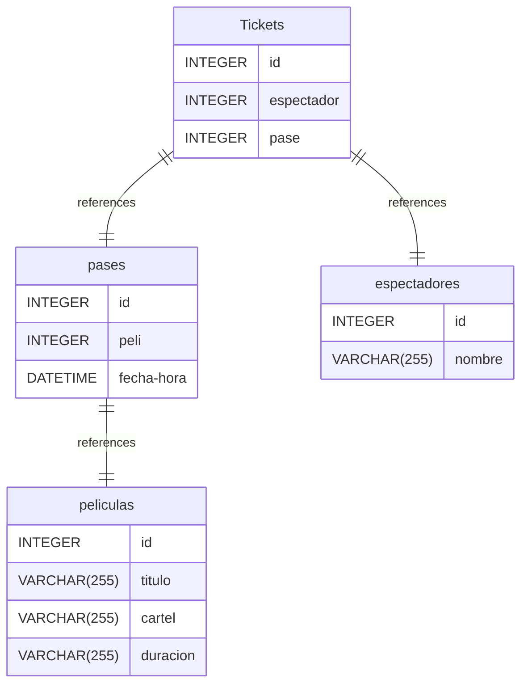

# Cines Gijón documentation
## Summary

- [Introduction](#introduction)
- [Database Type](#database-type)
- [Table Structure](#table-structure)
	- [pases](#pases)
	- [espectadores](#espectadores)
	- [peliculas](#peliculas)
	- [Tickets](#Tickets)
- [Relationships](#relationships)
- [Database Diagram](#database-Diagram)

## Introduction

## Database type

- **Database system:** MySQL
## Table structure

### pases

| Name        | Type          | Settings                      | References                    | Note                           |
|-------------|---------------|-------------------------------|-------------------------------|--------------------------------|
| **id** | INTEGER | 🔑 PK, not null , unique, autoincrement |  | |
| **peli** | INTEGER | not null  | fk_pases_peli_peliculas | |
| **fecha-hora** | DATETIME | not null  |  | | 

### espectadores

| Name        | Type          | Settings                      | References                    | Note                           |
|-------------|---------------|-------------------------------|-------------------------------|--------------------------------|
| **id** | INTEGER | 🔑 PK, not null , unique, autoincrement |  | |
| **nombre** | VARCHAR(255) | not null  |  | | 

### peliculas

| Name        | Type          | Settings                      | References                    | Note                           |
|-------------|---------------|-------------------------------|-------------------------------|--------------------------------|
| **id** | INTEGER | 🔑 PK, not null , unique, autoincrement |  | |
| **titulo** | VARCHAR(255) | not null  |  | |
| **cartel** | VARCHAR(255) | not null  |  | |
| **duracion** | VARCHAR(255) | not null  |  | | 

### Tickets

| Name        | Type          | Settings                      | References                    | Note                           |
|-------------|---------------|-------------------------------|-------------------------------|--------------------------------|
| **id** | INTEGER | 🔑 PK, not null , unique, autoincrement |  | |
| **espectador** | INTEGER | not null  | fk_Tickets_espectador_espectadores | |
| **pase** | INTEGER | not null  | fk_Tickets_pase_pases | | 

## Relationships

- **pases to peliculas**: one_to_one
- **Tickets to espectadores**: one_to_one
- **Tickets to pases**: one_to_one

## Database Diagram

